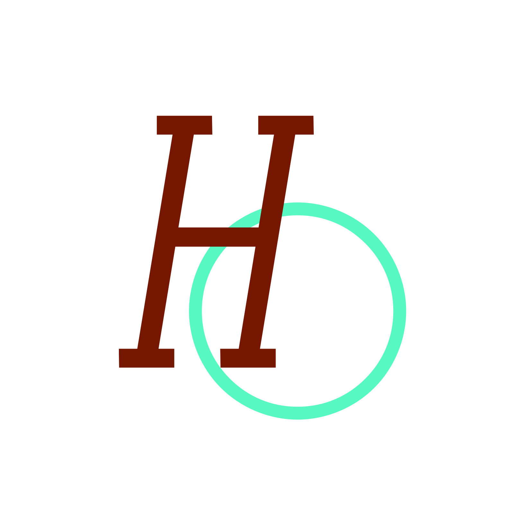

<!-- Project LOGO -->
<br />
<div align="center">
  <a href="https://github.com/hemingtsai/personal_homepage">
    
  </a>
  <h3 align="center">Lunapages</h3>
</div>

> A simple blog system based Vue

### 🏠 [Homepage](https://hmtsai.cn)

### ✨ [Demo](https://hmtsai.cn)

## Install

```sh
pnpm install
```

## Author

👤 **Hemingtsai**

- Website: https://hmtsai.cn
- Github: [@hemingtsai](https://github.com/hemingtsai)

## Show your support

Give a ⭐️ if this project helped you!
